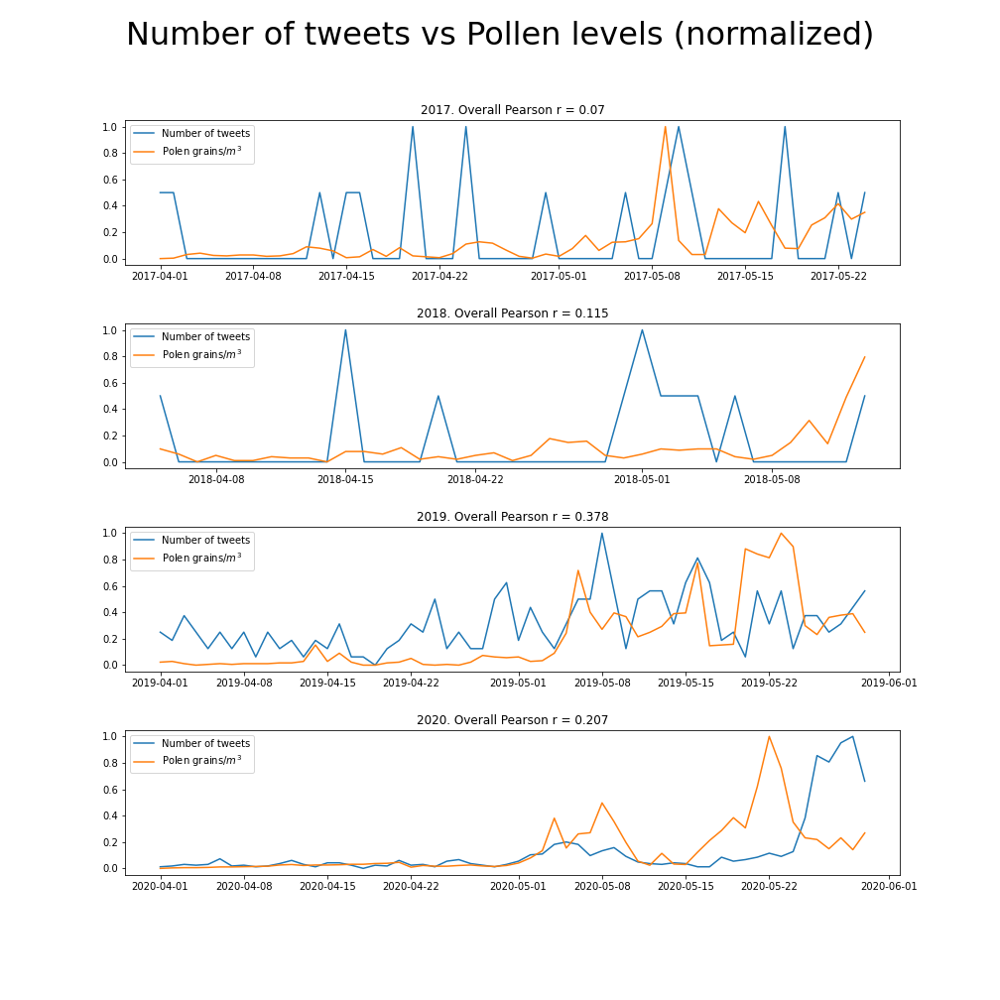
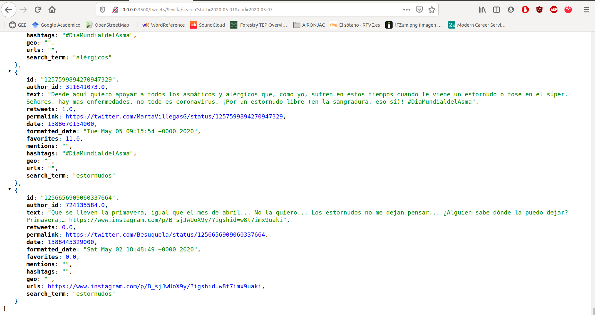
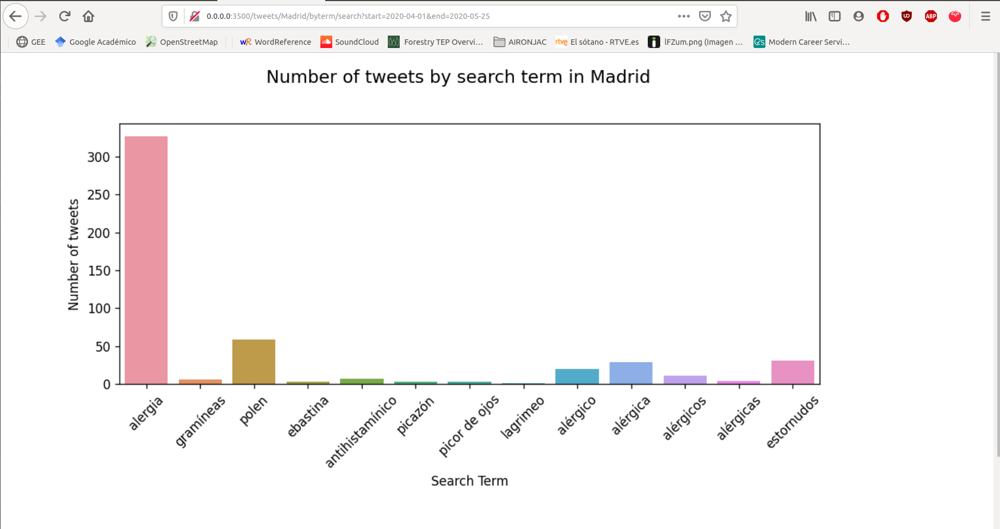
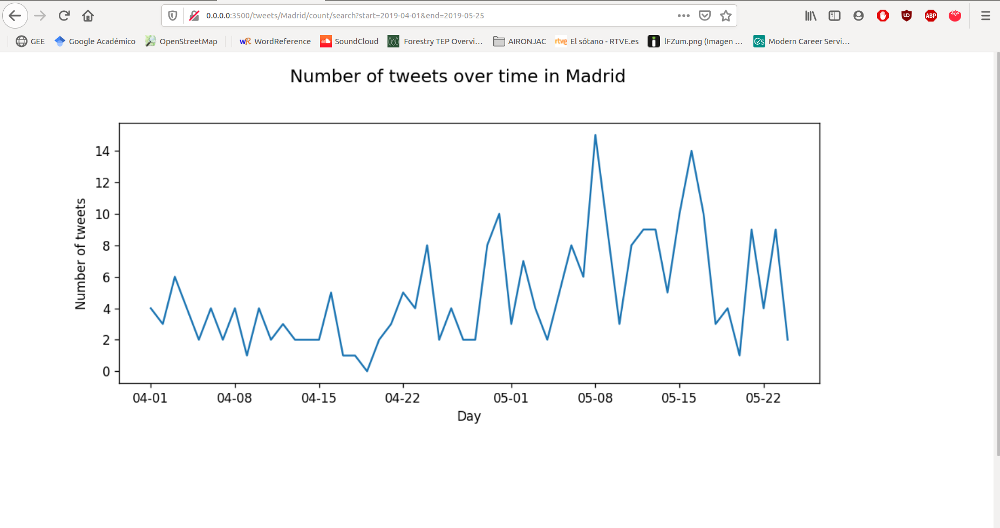

# Twitter Moquea

## Introduction 
This is a project aiming to determine if it is possible to detect grass pollen levels peaks through tweets from allergic people. We have extracted tweets from users reporting allergic symptons and then, these have been compared with pollen levels data gathered by the Sociedad Española de Alergología e Inmunología Clínica. Furthermore, an API has been developed for performing these tasks: tweets search and cleaning and results visualisation.

## Methodology

### Pollen data

The pollen data was obtained from the [Sociedad Española de Alergología e Inmunología Clínica website!](https://www.polenes.com/). This database is not downloadable at free charge, so only the data from the two Madrid stations (Clínica Subiza and Hospital Infanta Leonor) were gathered. Madrid was the location chosen because it has the most active Twitter community in Spain.

### Twitter data

In this project, only Tweets from Madrid containing keywords related with allergy and/or allergy symptoms and sent during the grass pollination period were gathered. The list of keyword was chosen based on the author's experience (grass allergic since 2001): 

[alergia, polen, gramineas, gramíneas, moqueo, picor de ojos, antihistamínicos, ebastel, lagrimeo, ebastina,alérgico, alérgica, alérgicos, alérgicas]

The pollination period was set from April 1st to May 31st. In order to increase the number of tweets, the analysis included data from 2017, 2018, 2019 and 2020. The extraction of tweets was performed with GetOldTweets3 library. As oppposed Tweepy and Twitter API, this library allows to get tweets older than one week.

### Data cleaning and statistical analysis

There were a lot of tweets containing the selected keywords which weren't related with allergic episodes. Therefore, the first step in the analysis was remove all these tweets by filtering by words like 'alegría', 'perros', 'gatos', 'Covid', etc.  The total clean tweets for every year are shown in the next table:

| Year  |Raw tweets| Clean tweets|
|------:|---------:|------------:|
|2017   |        23|           21|
|2018   |       108|           12|
|2019   |       786|          298|
|2020   |      2252|         1081|

**Table 1.** Number of gathered tweets before and after cleaning

The next step was normalize both series for each year to distinguish better the peaks. The formula used was:

y = (x - min) / (max - min)

Finally, the possible correlation between both series was analyzed by Pearson correlation.

### API creation

To give to the possible users a tool for extracting and analyzing the tweets, an API was created. Its funcionalities are:

* Scraping the tweets for a location and date range

* Storing the gathered tweets into a MongoDB data base.

* Cleaning and counting the number of tweets for a location and date range.

* Cleaning and counting the number of keywords found in the tweets for a location and date range.

## Results

### Correlation between number of allergic related tweets and grass pollen levels

The time series for each year and their Pearson correlation's value are shown in the next figure.

As shown in the plots, except for 2019, it looks there is no correlation between allergic symptoms episodes related tweets and pollen levels. This could be because of the low number of tweets used in this analysis. To improve the results, in future works it be necessary to increase the number of locations.

### API endpoints and results

* Scraping the tweets for a location and date range

* Plot the number of tweets (cleaned) by search term for a location and date range.

* Plot the number of tweets (cleaned) per day for a location and date range.

